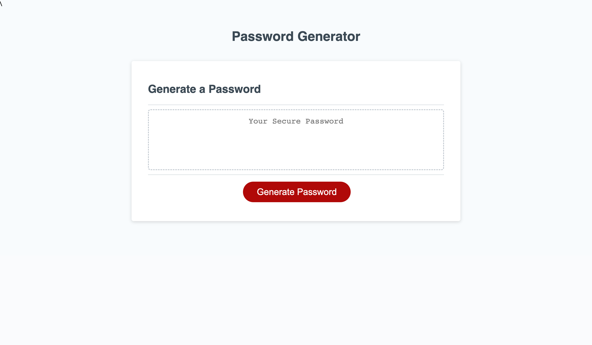

# Password Generator

## Description

The password generator webpage is designed to come up with a random password that includes the lentgh and the type of characters the user dseires for their new password. Once clicking 'Generate Password' the user will be given a series of prompts to enter in what type of password they are looking for and once they are don a new password will replace the default text of 'Your Secure Password'.

The goal of this project was to create a webpage that generated a random password for users. It can generate any password length between 8 and 128 characters, it utilizes special characters, numbers, lowercase letters, and uppercase letters. The user has the option of what type of characters they want in their password as well as the length of their password. Once the password is generated, it shows up inside the text box for the user to easily copy to their computer.

In this project I learned about arrays, for loops as well as conditionals. Initially, I created strings for the variables which I then converted to arrays so they could used in my conditonals for setting the password parameters and creating the for loop for the randomness of the characters. I also learned how to utilize math.random to get this random string of characters.

## Resources

[Deployed Site](https://cdgonzo23.github.io/password-generator/)

[Repository](https://github.com/cdgonzo23/password-generator)

### ScreenShots
